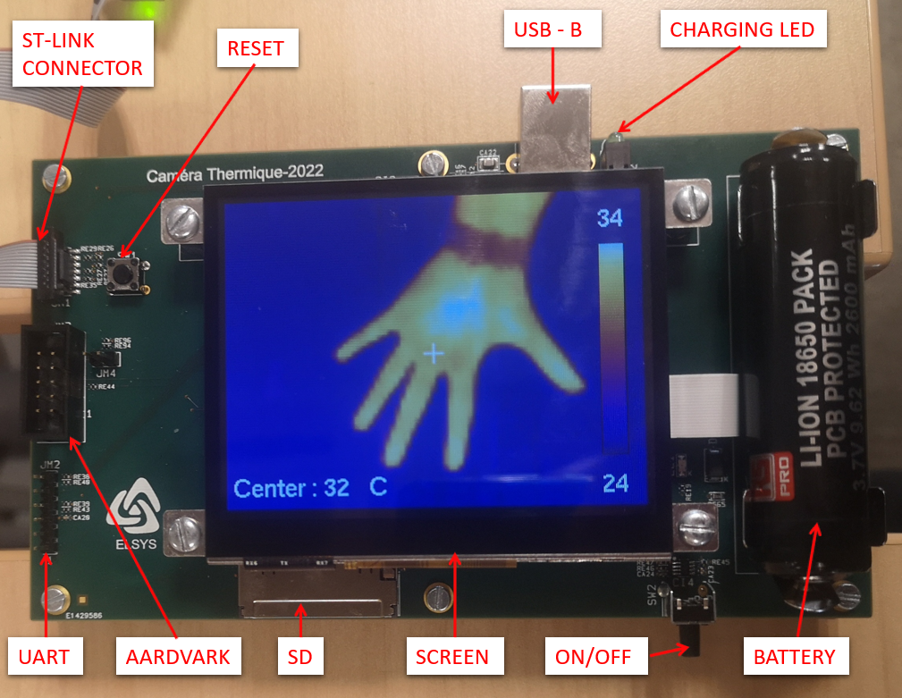

# Stage Camera Thermique 2022 @ Elsys Design

<p align="center">
  
</p>
<p align="center">
<em>2022 thermal camera internship</em>
</p>
 
## About The Project
The goal of the "Caméra Thermique" internship is to design and implement a thermal camera with all the electronics and software that comes with.
The final product shall embed the features listed below :
- a thermal camera for IR imaging,
- a daylight camera to compare the output with the IR image,
- a touchscreen to view the camera results, change display mode and take screenshots,
- an USB port to charge and communicate with the PC,
- a battery for the autonomy,
- an UART port to exchange debug messages,
- a SD card interface to save the screenshots, 
- an external RTC to get the time more accurately than with the mcu integrated RTC,
- a SWD/JTAG port for programming/debugging purposes

Go to the [specifications]([https://github.com/AlexandraHULOT/NuttX_Infrared_Camera/blob/main/documentation/Stage2022-ED_CdC_CameraThermique_V00.pdf](https://github.com/AlexandraHULOT/Camera_Thermique_2022/blob/main/documentation/Stage2022-ED_CdC_CameraThermique_V00.pdf)) for more details

## What will you find in this repository ?
You'll find here all NuttX sources for both the integration and developement parts.
However, from the official repo some changes have been made to meet our needs. Among them :
- The nuttx-src/apps folder contains an example named "thermal_camera". This is the `main` app of our project and it is the entrypoint for both the dev and final target  
- The Nuttx nuttx-src/nuttx/boards/arm/stm32h7 folder contains a custom board to support our final target `stm32h743vit6-ct2022`.
- The nuttx-src/nuttx/drivers folder contains custom drivers such as the one for the thermal camera.

You will also find in this repository :
- some notes and the projects used to test the stm32H743vit6-ct2022 board under documentation/integration,
- hardware documents under document/hardware,
- some wiring schematics under documentation/wiring,
- images of the project under /images,
- docker files to build the nuttx environnement on your machine.
s

## Build NuttX Environnement With Docker Image
### Step 0 - Prerequisities
You need `docker-compose` to build your docker image :
```
sudo apt install docker-compose
```
### Step 1 - Build Docker Image
In the directory where 'Dockerfile' is located (should be at the root of this repo), run :
```
docker-compose build
```
(By default, the parent image is `Ubuntu 20.04`).
### Step 2 - Build NuttX Environnement
In the directory where 'docker-compose.yml' is located (should be at the root of this repo too), run :
```
docker-compose run nuttxspace
```
If everything's fine, you should be inside the nuttx-src folder. 


## Build NuttX Environnement Without Docker Image
To build the NuttX environnement on a Linux-based system, install the following packages :
```
sudo apt install \
bison flex gettext texinfo libncurses5-dev libncursesw5-dev \
gperf automake libtool pkg-config build-essential gperf genromfs \
libgmp-dev libmpc-dev libmpfr-dev libisl-dev binutils-dev libelf-dev \
libexpat-dev gcc-multilib g++-multilib picocom u-boot-tools util-linux \
gcc-arm-none-eabi binutils-arm-none-eabi 
```
NuttX configuration system uses `KConfig` which is exposed via a series of interactive menu-based frontends, part of the `kconfig-frontends` package.
- For Ubuntu 20.04 and later : 
```
apt install kconfig-frontends
```
- For older Ubuntu releases : 
```
git clone https://bitbucket.org/nuttx/tools.git
cd tools/kconfig-frontends
./configure --enable-mconf --disable-nconf --disable-gconf --disable-qconf
make
make install
```
For any issues, please refer to the [Official NuttX Installing Page](https://nuttx.apache.org/docs/latest/quickstart/install.html).

## Build NuttX Image
### Step 1 - NuttX configuration
To configure Nuttx with a specific `<CONFIG>` and a specific `<BOARD>`, run from the `nuttx-src` folder :
```
cd nuttx
./tools/configure.sh <BOARD>\<CONFIG>
```
Usage : 
```
./nuttx/tools/configure.sh stm32h747i-disco\thermal_camera`
```

### Step 2 - Compile NuttX

Simply :
```
make
```
